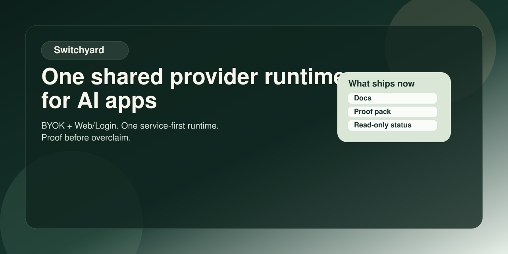
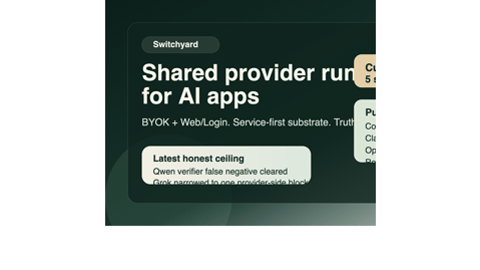
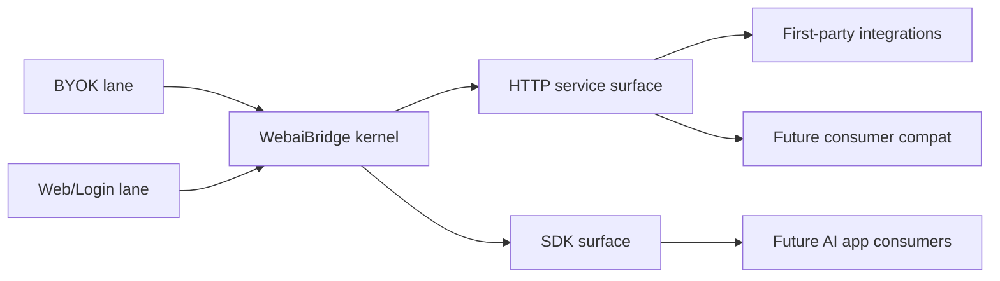

# WebaiBridge

**One shared provider runtime for AI apps.**

WebaiBridge turns end-user `BYOK + Web/Login` access into one service-first
runtime that AI products can call without rebuilding provider routing,
credential/session handling, and diagnostics from scratch.

It is **not** a chat product, **not** a personal assistant, and **not** another
all-in-one AI platform. It exists to be the shared runtime layer that other AI
apps can depend on.

<p align="center">
  
</p>

<p align="center">
  
</p>

## Builder Thesis

> **One shared provider runtime for AI apps.**
>
> Use WebaiBridge when you want AI products to plug into real end-user access
> lanes without every product re-inventing provider contracts, session logic,
> and diagnostics.

## Design Front Door

If you are changing UI, UX, or public-surface copy/IA, open
[DESIGN.md](./DESIGN.md) first.

That file is the thin entrypoint into the full design contract stack:

- root design truth and surface boundary
- `design-system/MASTER.md`
- page masters for `auth-portal` and the debug workbench
- any maintainer-only review packets that exist outside the public repo plane

## Current Public Boundary

Today the truthful public story is:

- **Single public router**: the GitHub Pages docs front door at
  [docs/index.html](./docs/index.html)
- **Root README role**: repo sentence, trust boundary, and the shortest
  truthful repo-native route
- **Primary repo-native runtime surface**: `apps/service/` and the
  service/runtime HTTP contract
- **Secondary machine-readable surface**:
  `packages/surfaces/mcp/server.json`, a **read-only MCP descriptor**
- **Builder-facing packet**:
  `distribution/claude-marketplace/plugins/webai-bridge-builder-suite/skills/runtime-diagnostics/`
  plus starter packs and host examples
- **Not claimed today**: official marketplace listings, official MCP Registry
  listing, npm publication, hosted multi-tenant runtime, write-capable MCP, or
  full consumer parity

Artifact-ready still does **not** mean listed-live.

## Public Language Policy

WebaiBridge now treats the public front door as **English-first**.

- The default landing path for global developers stays English-first.
- Bilingual support remains available through glossary and i18n helper pages.
- Live/browser realism notes belong in proof and runbook surfaces, not in the
  stable top-level product sentence.

## Open The Right Door

| If you need to... | Open this first |
| --- | --- |
| understand the product in 30 seconds | [docs/media/30-second-overview.md](./docs/media/30-second-overview.md) |
| run the shortest first success | [docs/first-success.md](./docs/first-success.md) |
| inspect what is really proved today | [docs/public-proof-pack.md](./docs/public-proof-pack.md) |
| see what is package-ready vs listed-live | [docs/public-distribution-ledger.md](./docs/public-distribution-ledger.md) |
| find the builder workflow / AI workflow route | [docs/README.md](./docs/README.md) |
| open promo or presentation assets | [docs/media/README.md](./docs/media/README.md) |
| bootstrap a local workstation or inspect workstation-bound reality | [docs/runbooks/dev-bootstrap.md](./docs/runbooks/dev-bootstrap.md) |
| browse the single public router first | [docs/index.html](./docs/index.html) |

If you are touching WebaiBridge for the first time, stop there.

The heavier shelves still exist, but they are not first-row front door pages:

- support signboard and bootstrap runbook
- contracts and blueprints
- builder workflow, starter-pack, and read-only MCP routers
- media shelf and promo assets
- submission-packet accounting
- builder catalog internals
- testing/governance reference pages

The old Wave 1 working packs were relocated out of the public docs plane, and
the real working copies now live in a private maintainer-only shelf that is
intentionally not tracked in the public repo history.

## 30-Second Version

If you only remember four lines, remember these:

1. WebaiBridge is **not** another AI app.
2. It is a **shared provider runtime for AI apps**.
3. It turns `BYOK + Web/Login` access into a service-first substrate that other
   AI products can call.
4. Today it ships a repo-native runtime, a partial read-only MCP surface, a
   runtime-diagnostics packet, starter packs, and truth-first public docs. npm,
   registry, marketplace, Docker, and broader publication remain later lanes.

## First Success

If you want the fastest truthful first success, run the shortest bounded path:

1. Start the local runtime:

   ```bash
   pnpm run start:service-local
   ```

2. Prove the read-only truth surface is alive:

   ```bash
   pnpm run example:mcp-inspector
   ```

3. Prove the runtime can accept one minimal invoke:

   ```bash
   pnpm run example:runtime-bridge
   ```

The default service port is `http://127.0.0.1:4010`.

If you want the full step-by-step path and failure routing, open
[docs/first-success.md](./docs/first-success.md).

If you prefer a click-first local experience instead of running the steps one by
one, use:

```bash
pnpm run start:local-experience
```

or, if you want the same local-first shell narrated as a runtime appliance:

```bash
pnpm run start:runtime-appliance
```

That command starts the local runtime plus a static docs front door and prints
the ready-to-open URLs for:

- `auth-portal`
- `runtime doctor`
- `runtime plan`
- `ChatGPT` debug workbench
- `doctor-first control ledger`
- `docs front door`

## Why WebaiBridge Exists

Many AI products keep rebuilding the same messy layer:

- provider contracts
- auth/session plumbing
- provider routing
- diagnostics and remediation
- builder starter surfaces

WebaiBridge exists so that this repeated work can become one reusable runtime:

> **a shared provider runtime that AI apps can plug into, instead of each app
> re-inventing the provider layer alone**

## What It Is

- a shared provider runtime for AI apps
- a service-first runtime surface with SDK and MCP companion surfaces
- a builder-facing repo that keeps proof, starter packs, and truth contracts
  aligned
- a runtime layer that stays fail-closed on claims it cannot honestly prove

## What It Is Not

- not a chat product
- not a personal assistant
- not a control-plane-first SaaS
- not a hosted multi-tenant runtime today
- not a browser plugin
- not a raw fork product of any upstream repo

## V1 Scope

WebaiBridge V1 is intentionally narrow:

- `BYOK`
- `Web/Login`

Current Web/Login provider set:

1. `ChatGPT`
2. `Gemini`
3. `Claude`
4. `Grok`
5. `Qwen`

Current BYOK code support must cover:

- `OpenAI`
- `Anthropic`
- `Grok / xAI`
- `OpenRouter`
- `Groq`
- `Qwen API`
- `Vertex AI`
- `Bedrock`

Explicit non-goals right now:

- `Agent Input Lane`
- `Codex` / `Claude Code` as supply-side sources
- `Gemini CLI`
- shared public credentials
- multi-tenant account pooling
- a hosted control plane

## Architecture In One Sentence

WebaiBridge separates **lane**, **provider**, **consumer**, and **surface** so
that the runtime stays reusable even while builder routes and public claims stay
fail-closed.

High-level shape:



## What Ships Now vs Later

### Ships now

- service-first runtime surface
- partial read-only MCP surface
- partial thin compat packages
- runtime-diagnostics public skill packet
- starter packs and host examples
- proof-first docs atlas and public distribution ledger

### Still later

- official marketplace listings
- official MCP Registry listing
- npm publication read-back
- Docker/runtime catalog publication
- hosted multi-tenant runtime
- full consumer parity
- write-capable MCP

## Proof And Reality Truth

Live/browser outcomes are important, but they are **proof / runbook truth for a
single credentialed workstation**, not the stable repo identity.

That means:

- repo-side green does not erase local browser/session blockers
- one workstation result should not rewrite the top-level product sentence
- current live/browser reality belongs in
  [docs/public-proof-pack.md](./docs/public-proof-pack.md)
  and [docs/runbooks/dev-bootstrap.md](./docs/runbooks/dev-bootstrap.md)

Use the proof pack when the question becomes:

- what is really proved today
- which blockers are external-only
- which results depend on local credentials and browser session materials

## Distribution Truth

Current distribution truth is intentionally narrow:

- GitHub Pages storefront remains the primary public homepage path and is
  currently treated as `public-ready` rather than `listed-live`
- repo materials are package-ready for the MCP surface and thin compat packages
- official marketplace or registry publication is **not** claimed yet
- builder packets and starter packs are public repo surfaces, not official
  listings
- packet-scoped host receipts, including the
  `webai-bridge-runtime-diagnostics` packet, belong in the packet's own manifest
  and README; they do **not** upgrade repo-wide npm, marketplace, or official
  MCP Registry truth

See:

- [DISTRIBUTION.md](./DISTRIBUTION.md)
- [INTEGRATIONS.md](./INTEGRATIONS.md)
- [docs/public-distribution-ledger.md](./docs/public-distribution-ledger.md)

If you need the exact heavy-lane packet or older staging material, treat them as
deeper shelves rather than the default first stop.

## Docs Atlas

### First-row public routes

- [docs/index.html](./docs/index.html)
- [docs/README.md](./docs/README.md)
- [docs/media/30-second-overview.md](./docs/media/30-second-overview.md)
- [docs/first-success.md](./docs/first-success.md)
- [docs/public-proof-pack.md](./docs/public-proof-pack.md)
- [docs/public-distribution-ledger.md](./docs/public-distribution-ledger.md)
- [docs/api/service-http-reference.md](./docs/api/service-http-reference.md)
- [docs/api/openapi.yaml](./docs/api/openapi.yaml)

### Deeper public shelves

- API and diagnostics
  - [docs/api/sdk-quickstart.md](./docs/api/sdk-quickstart.md)
  - [docs/api/mcp-readonly-server.md](./docs/api/mcp-readonly-server.md)
  - [docs/api/error-diagnostics-reference.md](./docs/api/error-diagnostics-reference.md)
  - [docs/api/web-login-acquisition.md](./docs/api/web-login-acquisition.md)
- Builder adoption and route catalogs
  - [examples/README.md](./examples/README.md)
  - [starter-packs/README.md](./starter-packs/README.md)
  - [docs/host-integration-playbooks.md](./docs/host-integration-playbooks.md)
  - [examples/hosts/README.md](./examples/hosts/README.md)
  - the paired machine-readable catalogs that these routers point to, now kept
    under [`catalogs/`](./catalogs/)
- Public support truth
  - [docs/public-surface-support-matrix.md](./docs/public-surface-support-matrix.md)

If you need the fuller shelf map for compat, MCP, FAQ, glossary, helper-page
language support, or the wider catalog family, open
[docs/README.md](./docs/README.md) instead of turning this root README into a
public warehouse list.

### Internal-only working packs

- WebaiBridge keeps its maintainer-only contracts, ledgers, and working packs in
  a private local maintainer shelf when present in the maintainer workspace.
- That shelf is intentionally **not** part of the public repo history.
- Public readers should rely on the first-row docs, proof pack, API reference,
  and runbook surfaces instead of expecting private maintainer files to exist.

## Truth Rules

- `supported` means there is a durable, repo-backed public surface now.
- `partial` means a real narrow slice exists, but it is not the full promised
  shape.
- `planned` means the route is intentional but not landed.
- `research` means investigation exists but support does not.
- `not now` means the surface is explicitly outside the current public front
  door.

## Security And Local Runtime Boundaries

- Do not publish cookie bundles, browser profiles, or other credential
  materials.
- `.runtime-cache/`, maintainer-only shelves, and `.env*` stay out of public
  release
  surfaces.
- Repo-local cleanup only applies to WebaiBridge-owned runtime artifacts, never
  to machine-wide caches or other apps.
- Before live/browser/cleanup actions, run:

  ```bash
  pnpm run scan:host-process-risks
  ```

For local runtime hygiene, browser/session acquisition, and operational
footprint, go to [docs/runbooks/dev-bootstrap.md](./docs/runbooks/dev-bootstrap.md).

## Verification Entry Points

- `pnpm run typecheck`
- `pnpm run test:coverage`
- `pnpm run test:docs-frontdoor`
- `pnpm run build`

## One Final Sentence

> WebaiBridge exists because AI apps should share one honest provider runtime
> instead of each product rebuilding the provider layer alone.
